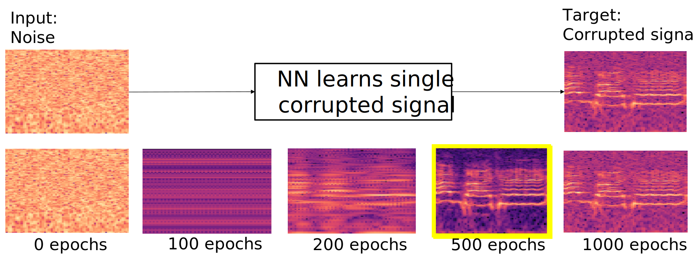

# Deep Audio Waveform Prior (Interspeech 2022)
[](https://arxiv.org/abs/2207.10441)

Official PyTorch implementation of the paper: "Deep Audio Waveform Prior". 

<br>

## Abstract

Convolutional neural networks contain strong priors for generating natural looking images [1]. These priors enable image denoising, super resolution, and inpainting in an unsupervised manner. Previous attempts to demonstrate similar ideas in audio, namely deep audio priors, (i) use hand picked architectures such as harmonic convolutions, (ii) only work with spectrogram input, and (iii) have been used mostly for eliminating Gaussian noise [2]. In this work we show that existing SOTA architectures for audio source separation contain deep priors even when working with the raw waveform. Deep priors can be discovered by training a neural network to generate a single corrupted signal when given white noise as input. A network with relevant deep priors is likely to generate a cleaner version of the signal before converging on the corrupted signal. We demonstrate this restoration effect with several corruptions: background noise, reverberations, and a gap in the signal (audio inpainting).

<br>


## Getting Started
### Prerequisites
- Linux or macOS
- Python>=3.7
- NVIDIA GPU + CUDA CuDNN (Not mandatory bur recommended)

### Installation

1.  Clone the repo:
	```bash
	git clone https://github.com/Arnontu/DeepAudioWaveformPrior.git
	cd DeepAudioWaveformPrior
	```
2. Install dependencies
	- torch
	- torchvision
	- torchaudio
	- librosa
	- matplotlib
	- pesq
	- julius
	- tqdm
	- scipy


### Preparing your Data
To evaluate denoising (clean,noisy) audio pairs are required, but you can provide only clean samples.
The source to should be specified using \--source  and it's format explained in the following
1. You want to provide only clean samples
Matching noisy will be generated accoridngly to the given arguments.
**Source** optional formats:
	1.  **Directory**: will consider all supported audio files (also in sub directories)
	2. **File**: excpect each line to be a path to an clean audio
	>/path/to/clean_example_1.wav
	>/path/to/clean_example_2.wav
2. You want to provide (clean,noisy)
	**Source** expected to be a **File**. Each line contains a clean path and a noisy path, separated by a comma with the clean path first.
>/path/to/clean_example_1.wav,/path/to/noisy_example_1.wav

### Running 

```bash
#!./scripts/denoise.sh
SOURCE=#<path/to/source>
python3.7 denoise.py --experiment_repetition 20 --show_every 250 --noise_class GAUSSIAN --noise_std 0.2 --snr 2.5 --depth 2 --lstm_layers 4 --source $SOURCE --samplerate 16000 --clip_length 2
```


<br>
## Acknowledgments
Our experiments based on the [Demucs(v2) model](https://github.com/facebookresearch/demucs/tree/v2) 


## Contact
For any inquiry please contact by email: [arnon.turetzky@mail.huji.ac.il](mailto:arnon.turetzky@mail.huji.ac.il)


## Citation
If you find this useful for your research, please use the following:
```
@inproceedings{turetzky22_interspeech,
  author={Arnon Turetzky and Tzvi Michelson and Yossi Adi and Shmuel Peleg},
  title={{Deep Audio Waveform Prior}},
  year=2022,
  booktitle={Proc. Interspeech 2022},
  pages={2938--2942},
  doi={10.21437/Interspeech.2022-10735}
}
```